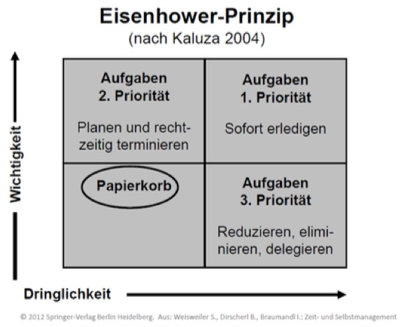
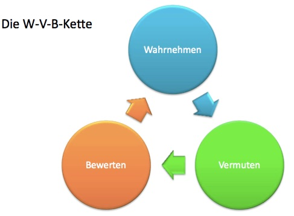
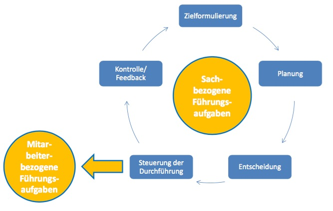
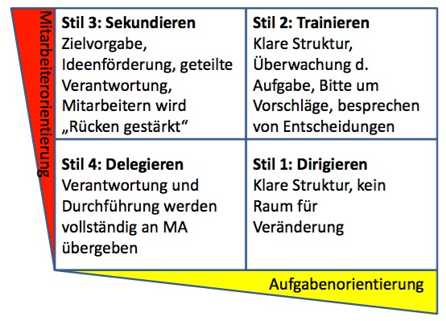
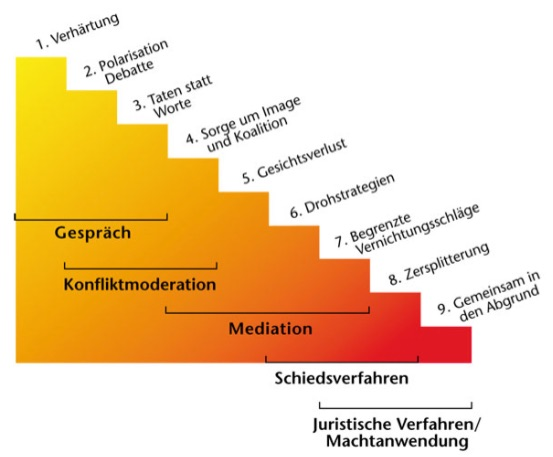

# KFS Compilation

## Zeitmanagement

### Definition Zeitmanagement

**Selbstkontrollierte** Bemühungen, Zeit auf eine subjektiv **effiziente** Art und Weise zu verwenden, um **Ziele** zu **erreichen.**

### Grundsätze

- Schriftlichkeit
    - gibt besseren Überblick, erhöht Realisierbarkeit
- Veröffentlichung
    - Motivation, Verbindlichkeit
- Überprüfung und Anpassung
    - gewährleistet Nutzen / Wert

### Work-Life-Balance

- strikte Trennung von Arbeit und Freizeit
    - trotz Home office etc..
    - Handy aus ...
- Fremdbestimmung durch Mails und Nachrichten
- Prioriäten setzen

### Ziele

#### Bedeutung von Zielen

- wirken aktivierend, bilden Grundlage motivierten Handelns
- wirken strukturierend
- Zielfortschritt und Zielerreichung fördern das Wohlbefinden.

#### Ziele formulieren / SMART-Regel

> Ziele sollten SMART formuliert werden, damit sie handlungsaktivierend wirken.

- Spezifisch
    - konkret
    - eindeutig formuliert
    - schriftlich fixiert
- Messbar
    - qualitativ formulieren
    - quantitativ festelegt
- Attraktiv
    - herausfordernd
    - anspruchsvoll
    - relevant
- Realistisch
    - erreichbar mit den vorhandenen Ressourcen
- Terminiert
    - konkreter Zeitpunkt festgelegt
    - Teilschritte festgelegt

> Mein Ziel ist es, bis Dezember 2015 an einer 2-tägigen Weiterbildung und einem internationalen Fachkongress teilzunehmen. Das Einverständnis und die Kostenübernahme hole ich beim Mitarbeitergespräch im Januar ein.

### Effizienz / Effektitivät

- **Effektivität**
    - "Die richtigen Dinge tun."
    - *Zielerreichungsgrad*
    - Hat mich die Tätigkeit meinem Ziel näher gebracht?
- **Effizienz**
    - "Die Dinge richtig tun."
    - *Aufwandoptimierung*
    - Stehen die eingesetzten Mittel/Zeit in einem guten Verhältnis zum Ergebnis?

> Medikament A und B sind bei der Behandlung von Schmerzen beide effektiv (wirksam, Ziel: Schmerzlinderung). A ist jedoch effizienter als B, da bei gleicher Wirksamkeit weniger Wirkstoff nötig...

#### Effizienzsteigerung

- Pausen
    - alle 45-60min ca. 5min Pause
- Multitasking bei Arbeiten die viel Konzentration erfordern vermeiden
    - lieber eine Sache zügig und gründlich, statt mehrere Dinge nur halb und oberflächlich
- ähnliche Arbeiten in Blöcken verrichten
    - Telefonate, PC-Arbeiten, Ablage...
- Unterbrechungen vermeiden
- individuelle Leistungskurve / Biorythmus berücksichtigen

---

### Zeitplanungsmethoden

#### Zeitdiebe

- unklare Zielsetzung
- fehlende Prioritäten
- fehlende Übersicht über anstehende Aufgaben und Aktivitäten
- mangelnde Koordination / Teamwork
- Unterbrechungen / Ablenkungen
- mangelnde Vorbereitung auf Gespräche und Besprechungen
- ...

#### Eisenhower-Prinzip

- ***Wichtigkeit***
    - *Wertkomponente*
    - hoher Nutzen wird gestiftet
    - hoher Wert materiell/immatriell
    - hoher Schaden wird vermindert
    - **bringt mich Zielen näher**
- ***Dringlichkeit***
    - *Zeitkomponente*
    - haben einen Termin
    - die Zeit drängt

| Priorität | Kurzform                         | Handlung                                                                                   |
|:----------|:---------------------------------|:-------------------------------------------------------------------------------------------|
| 1 (A)     | wichtig / dringend               | **sofort erledigen**                                                                       |
| 2 (B)     | wichtig / nicht dringend         | **planen und rechtzeitig terminieren**, ggf. deligieren                                    |
| 3 (C)     | weniger wichtig / dringend       | **wenn möglich deligieren**, ansonsten mit geringst möglichem Aufwand erledigen.           |
| 4 (D)     | weniger wichtig / nicht dringend | **Papierkorb**, wenn es sein muss dann in einer störungsreichen Zeit oder im Leistungstief |

#### 3-W-Regel

- **Was**/Welche Arbeitsschritte sind zu tun?
- **Wie lange** werden sie dauern?
- **Welche Zeitpuffer** plane ich ein?

#### 60:40 Regel

- Zeit für Unvorhergesehenes
- 60% der Zeit fest geplant
    - Tagesplan, to-do-Liste
- 40% der Zeit frei verfügbar
    - Unvorhergesehenes
    - Zeitdiebe
    - Spontanes (soziale kreative Akt.)

> Ein Tagesplan, der 100% der Arbeitszeit mit Aufgaben / Tätigkeiten abdeckt, kann unmöglich eingehalten werden!

#### Pareto-Prinzip

- 80% der Ergebnisse werden mit 20% des Gesamtaufwandes erreicht
- die letzten 20% benötigen 80% des Aufwandes

#### Tagesplanung mit der ALPEN-Methode

- **A**: Aufgaben, Termine notieren
    - to-do-Liste, Notizen
- **L**: Länge der Aktivitäten schätzen
    - 3-W Regel
- **P**: Pufferzeiten einplanen
    - 60:40 Regel
- **E**: Entscheidungen treffen
    - (Eisenhower-Methode)
- **N**: Nachkontrolle, Erledigtes streichen, Rest übertragen

## Kommunikation

### Verbale/Paraverbale/Non-verbale Kommunikation

| Verbal   | Paraverbal | Non-Verbal                                 |
|:---------|:-----------|:-------------------------------------------|
| Sprache  | Stimme     | Gestik                                     |
| Wortwahl | Lautstärke | Mimik                                      |
|          | Tonfall    | Körperhaltung                              |
|          | Tempo      | Nähe/Distanz                               |
|          |            | Kleidung                                   |
|          |            | vegetative Vorgänge (Schwitzen,Erröten...) |

Etwa

- 7% Verbal
- 38% Paraverbal
- 55% Non-Verbal

Anteil an der Kommunikation.

### Sender-Empfänger-Modell (Shannon-Weaver-Modell)

- beschreibt *Kommunikation als Übertragung einer* ***Nachricht*** *von einem* ***Sender*** *zu einem* ***Empfänger.***
- dazu wird die Nachricht **kodiert** und als **Signal** über einen **Übertragungskanal** übermittelt.
- Nachricht kann *durch Störungen verfälscht* werden
- Voraussetzung für die *erfolgreiche Kommunikation* ist, dass Sender und Empfänger **denselben Code** für die Nachricht verwenden
    - mitgeteilte Nachricht soll nach Kodierung und Dekodierung identisch sein

### 5 Axiome nach Watzlawick

1. **Man kann nicht *nicht* kommunizieren**
    - Jedes Verhalten hat in einer sozialen Situation Mitteilungscharakter und ist somit Kommunikation.
    - (Man kann sich nicht nicht verhalten)
2. **Jede Kommunikation hat einen Inhalts- und einen Beziehungsaspekt**
    - *Inhaltsaspekt* = das *Was* der Mitteilung (eher digital)
    - *Beziehungsaspket* = das *Wie* der Mitteilung (eher analog)
3. **Kommunikation ist immer Ursache und Wirkung**
    - Verhalten des einzelnen Teilnehmers ist sowohl
        - Reaktion auf das Verhalten des anderen
        - als auch Reiz und Verstärkung für das Verhalten des anderen
4. **Menschliche Kommunikation bedient sich analoger und digitaler Modalitäten**
    - *digitale Modalität* = Mitteilung durch Sprache
    - *analoge Modalität* = Mitteilung durch Entsprechungen (Mimik, Gestik)
5. **Zwischenmenschliche Kommunikationsabläufe sind entweder symmetrisch oder komplementär**
    - *symmetrische Beziehung* = Partner sind einander in ihrem Verhalten ebenbürtig, Kommunikation ist ausgewogen
    - *komplementäre Beziehung* = Partner haben ein über/untergeordnetes Verhältnis, Kommunikation beruht auf Unterschieden, die angenommen, anerkannt werden

### Eisbergmodell

Kommunikation findet zu

- *20% auf der Sachebene*
- *80% auf der Beziehungsebene*

statt. Die Beziehungsebene beeinflusst maßgeblich die Sachebene.
Solange die Beziehung zwischen den Kommunikationspartnern gut ist, ist dies unproblematisch.

### Nachrichtenquadrat

Das Nachrichtenquadrat oder die vier Seiten einer Nachricht nach Friedemenn Schulz von Thun.

> Mit vier Schäbeln sprechen und vier Ohren hören

#### Kommunikationsebenen

- **Sache**
    - *Worüber ich dich informiere*
    - "Die Ampel ist grün."
- **Beziehung**
    - *Was ich von dir halte*
    - "Du brauchst meine Unterstützung"
- **Selbstkundgabe**
    - *Was ich von mir selbst preisgebe*
    - "Ich habe es eilig."
- **Apell**
    - *Wozu ich dich veranlassen möchte*
    - "Gib Gas!"

#### Kommunikations-/Gesprächsstörer

- Sender/Empfänger
    - Wenn Sender und Empfänger *auf unterschiedlichen Kommunikationsebenen* bzw. *auf mehreren Ebenen gleichzeitig* kommunizieren, drohen Kommunikationsstörungen.
- Empfänger
    - In der Regel hört der Empfänger *nicht mit allen 4 Ohren gleich gut*, sondern hat ein *besonders gut ausgeprägtes Ohr* oder hört bei bestimmten Personen/Situationen immer auf einem Ohr.

### Gesprächsführung

#### Aktives Zuhören

- Haltung des "einfühlenden Verstehen-Wollen"
- Perspektivwechsel: hilft, die Welt mit den Augen des anderen zu sehen
- bedeutet nicht, der Meinung des anderen zuzustimmen
- erfordert echtes Interesse am Gesprächspartner und nicht nur "mit halbem Ohr" hinzuhören

##### Leitlinien des aktiven Zuhörens nach Carl Rogers

- Empathische und offene Grundhaltung
- Authentisches und kongruentes Auftreten
- Akzeptanz und positive Beachtung der anderen Person

##### Wirkung des aktiven Zuhörens

- **Besseres Verständnis**
    - Mißverständnisse können direkt aufgeklärt werden
    - Wem zugehört wurde, der hört auch selbst eher zu
- **Selbstklärung**
    - Sender findet eigene Antworten, statt Ratschläge geben
- **Tempobremse**
    - Entschleunigung durch nachhaltigen Gesprächserfolg
- **Fokussierung bzw. Anregung des Redeflusses**
    - wer sich verstanden fühlt, muss nicht alles 3x mit anderen Worten wiederholen
    - zurückhaltende Redner öffnen sich beim geduldigen aktiven Zuhören

##### Wann ist aktives Zuhören angebracht / unangebracht?

- ***angebracht:***
    - wenn jemand etwas **kompliziertes, persönliches** oder **nicht leicht nachvollziehbares** erzählt
    - bei **Streit**
    - beim **beratenden Gespräch**, dass dem Gesprächspartner Klarheit über seinen Standpunkt bringen soll
- ***unangebracht:***
    - Bei **Angriffen** oder **Herausforderung zur Stellungnahme**
    - Wenn der Gesprächspartner **Grenzen setzt** "Darüber möchte ich nicht weiter sprechen."

##### 3 Stufen des aktiven Zuhörens

1. **Beziehungsebene**
    - *Ich bin jetzt ganz Ohr*
    - Störquellen ausschalten
    - Körpersprache (sich einander zuwenden, Blickkontakt)
    - "soziales Grunzen" (Hmm, Aha, Ja...)
2. **Inhaltsebene**
    - *Ich habe verstanden, was Du sagst*
    - Inhaltliche Aussagen mit eigenen Worten zusammenfassen (Paraphrasieren)
        - "Verstehe ich richtig, ...?"
        - "Du meinst also, ..."
3. **Gefühle verbalisieren**
    - *Ich nehme wahr, wie es Dir dabei geht*
    - non-verbale und paraverbale Signale beachten
    - Gefühlsvermutungen ausdrücken (Spiegeln)
        - "Das scheint Sie richtig zu ärgern..."

#### Fragetechniken

- ***Offene Fragen***
    - *W-Fragen*
        - wie, was, wann, wo, wer
    - bringen Informationen
    - fördern die Auseinandersetzung mit dem Thema
    - führen weiter
- ***Geschlossene Fragen***
    - *Ja/Nein-Fragen, Fakten*
    - fordern zur Entscheidung auf
    - Halten gemeinsame Ergebnisse fest
    - schließen Thema ab

#### Wahrnehmung

##### WVB-Kette

Wahrnehmen -> Vermuten -> Bewerten -> Wahrnehmen ->...

- klare Unterscheidung zwischen Wahrnehmung, Vermutung/Interpretation und Bewertung
    - "Ich habe in Bezug auf Dein Verhalten eine Vermutung. Möchtest du sie hören?"

##### Konstruktivismus

- Jeder bildet sich seine eigene Realität auf Basis seiner Erfahrungen und Sinnesreize

> Es gibt nicht die eine Wirklichkeit für alle Menschen. Vielmehr ist die Realität für jedes Individuum eine Konstruktion aus Sinnesreizen und individueller Gedächtnisleistung (die sich aus dem Erfahrungsschatz speist). Deshalb ist Objektivität im Sinne einer Übereinstimmung von wahrgenommenem (konstruiertem) Bild und Realität unmöglich; jede Wahrnehmung ist vollständig subjektiv.

> "Verstehen ist nicht möglich, bestenfalls können wir uns konstruktiv missverstehen. Der Normalfall ist das Missverständnis." - Paul Watzlawick

##### Bild des Anderen

- ***Der erste Eindruck***
    - Mimik, Gestik, Sprache, ...
- ***Selektive Wahrnehmung***
    - nur bestimmte Aspekte / Fokus
- ***Kategorisierung***
    - ein Merkmal reicht für eine Schublade
- ***Augenblickliche Rolle***
    - Student, Vorgesetzte, Vater, ...
- ***Übertragung***
    - alte Erfahrungen
- ***Vermutungen***
    - ...werden zu Tatsachen umgemünzt...
- ***Sympathiefehler***
    - sympathischen Menschen werden positive Eigenschaften zugeschrieben
- ***Einfrieren***
    - wir glauben, Verhalten ist unabänderbar
- ***Projektion***
    - eigene Fehler sind beim Anderen unentschuldbar
- ***Gegenseitige Beeinflussung***
    - Man wird so, wie man vom Partner gesehen wird...

#### ICH-Botschaften

"Ich mach mir Sorgen, dass ..."

- Selbstoffenbarung **ohne Wertung und Maßregelung** des Gegenübers
- rufen beim Gesprächspartner **weniger Widerstand** hervor
- ermöglichen **Aufrechterhaltung der Beziehung** unter den Gesprächspartnern
- können die Bereitschaft fördern, einen Standpunkt zu ändern
- Anschließend auf *aktives Zuhören* umschalten, und keine drängenden ICH-Botschaften nachschieben

### Argumentation

#### 5-Satz-Technik

Fünfsätze helfen dabei, Kernbotschaften knapp und präzise darzustellen.

- *1. Schritt:* **Einleitung**
    - Anknüpfen an Diskussionsbeitrag
    - IST-Situation
    - Problembeschreibung
- *2. - 4. Schritt:* **Hauptteil**
    - drei argumentative Schritte (Beweisführung)
    - Argumentreihenfolge
        - zuerst das zweitbeste
        - dann das schwächste
        - dann das stärkste
- *5. Schritt:* **Schluss**
    - Hauptaussage, Zielsatz
        - kann als Appell formuliert werden
        - bringt Essenz der Argumentation auf den Punkt

##### Zwei wichtige 5-Satz-Strukturen

###### Standpunkt

1. Standpunkt / These
2. Argument
3. Beispiel
4. Schlussfolgerung
5. Zwecksatz

Zum Beispiel:

1. Ich bin gegen Rauchen
2. Das Rauchen schadet der Gesundheit
3. Mein ... ist an Lungenkrebs gestorben
4. Man sollte sich vor Augen führen, welche gesundheitlichen ... für die eigene Person und andere ...
5. Bitte rauchen Sie nicht!

###### Dialektischer Fünfsatz

1. Thema
2. Argument Pro
3. Argument Contra
4. Schlussfolgerung
5. Zwecksatz

- Wenn man mehr zur Pro-Seite neigt, dann Schritt 2 und 3 tauschen.

## Führung

### Definitionen

#### Definition Personale Führung (nach Rosenstiel)

Führung ist die *unmittelbare, absichtliche und zielbezogene Einflussnahme* durch bestimmte Personen (Vorgesetzte) auf andere (Nachgeordnete) *mit Hilfe von Kommunikationsmitteln*.

#### Definition Mitarbeiterführung

Führung bedeutet, **Mitarbeiter** so zu **beeinflussen**, dass durch ihr Handeln das übergeordnete Ziel - der **Unternehmenserfolg** - unter weitgehender Berücksichtigung **individueller Erwartungen** erreicht wird.

- Personal effizient einsetzen = ökonomische Aufgabe
- Personal zufriedenstellen = soziale Aufgabe
- = Gutes Personalmanagement

### Sachbezogene Führungsaufgaben

#### Managementkreislauf

1. Zielformulierung
2. Planung
3. Entscheidung
4. Steuerung der Durchführung
    - Schnittstelle zu den mitarbeiterbezogenen Führungsaufgaben
5. Kontrolle / Feedback

### Mitarbeiterbezogene Führungsaufgaben

- Motivieren
- Lob & Wertschätzung
- Sanktionieren & Schlichten
- Fördern & Entwickeln
- Informieren

### Führungsstile

Der **Führungsstil** ist die Art und Weise wie die Führungskraft die Managementfunktionen ausübt.

#### Grundüberlegungen

- Aufgabenorientiert "Dirigieren"
    - Autoritäre Führungskraft
    - Vorgaben, Lenken, Überwachen
    - FK sagt anderen was, wie, wo und wann zu tun ist
    - bietet Orientierung und Sicherheit
- Mitarbeiterorientiert "Sekundieren"
    - partizipative Führungskraft
    - Begleiten, teilhaben lassen
    - FK hört zu, unterstützt und ermutigt
    - bietet Beteiligung / Einfluss und Selbstwert

#### Modell des situativen Führens nach Hersey & Blanchard (Reifegradmodell)

Der Führungsstil muss sich am **Erfahrungs- und Wissensstand** und den **aktuellen Bedürfnissen** des **Mitarbeiters** orientieren.
Der Reifegrad ist an bestimmte Aufgaben gebunden.
Effektivität ist dann gegeben, wenn der gewählte Führungsstil zum Reifegrad des Mitarbeiters passt.

| Stil            | Aufgabenorientierung | Mitarbeiterorientierung |
|:----------------|:--------------------:|:-----------------------:|
| 1 - Dirigieren  |          +           |            -            |
| 2 - Trainieren  |          +           |            +            |
| 3 - Sekundieren |          -           |            +            |
| 4 - Delegieren  |          -           |            -            |

- ***Stil 1: Dirigieren***
    - Klare Struktur
    - kein Raum für Veränderungen
- ***Stil 2: Trainieren***
    - Klare Struktur
    - Überwachung der Aufgabe
    - Bitte um Vorschläge
    - Besprechen von Entscheidungen
- ***Stil 3: Sekundieren***
    - Zielvorgabe
    - Ideenförderung
    - geteilte Verantwortung
    - Mitarbeitern wird "Rücken gestärkt"
- ***Stil 4: Delegieren***
    - Verantwortung und Durchführung werden vollständig an MA übergeben

#### Delegieren

Führungskraft kann **Aufgaben, Tätigkeiten** an hierarchisch untergeordnete Mitarbeiter delegieren (lat. delegare = hinschicken, anvertrauen, übertragen).
Wird mit den Tätigkeiten auch **Verantwortung** delegiert, so spricht man von einem *demokratischen Führungsstil*.

Verantwortung übertragen heißt:

- Befugnisse einzuräumen
- Risiken einzugehen (Fähigkeit und Zuverlässigkeit des Delegationsempfängers)
- Weniger Einfluss auf den Arbeitsprozess nehmen zu können und damit Macht abzugeben

*Die Bereitschaft zur Übertragung von Verantwortung hängt von der Persönlichkeit und dem Führungsverständnis der Führungskraft ab.*

##### Vorteile des Delegierens

- ***Nutzen für die Führungskraft***
    - **Entlastung** zugunsten wichtigerer Führungsaufgaben
    - **Lösung** auftretender Probleme auch **bei Abwesenheit der FK**
    - **Heranbilden** von Mitarbeitern für längerfristige Vorgesetztenvertretungen
    - Erkennen verborgener **Qualitäten** und **Entwicklungspotentiale** von Mitarbeitern
- ***Nutzen für den Mitarbeiter***
    - Chancen für **motivierende Erfolgserlebnisse**
    - Stärkung von **Verantwortungsbewusstsein** und **Risikobereitschaft**
    - Entwicklung von **Selbstständigkeit**, **Kreativität** und **Entscheidungsfähigkeit**
    - Erwerb neuer Fähigkeiten durch Erfahrungen, bessere Karrierechancen

##### Häufige Fehler des Delegierens

- Delegieren unter Zeitdruck
- Delegieren ohne ausreichende Information und Erläuterungen
- Erwarten eines "perfekten" Ergebnisses
- Rückdelegation

##### Grenzen des Delegierens

Verfahrens in **ungeplanten Situationen** liegt in der **Entscheidungsverantwortung** der Führungskraft.
Diese kann aber, soweit nützlich und vertretbar, fallweise delegiert werden.
Die **Gesamtverantwortung** ist ureigenster Bestandteil des Führungsauftrags und somit **grundsätzlich nicht delegierbar**.

##### Verantwortungsdelegation

- ***Zur Verantwortungsdelegation gut geeignet***
    - **Normalfälle**
    - häufig wiederkehrende Arbeiten mit einmaligem Einweisungsaufwand
    - Zeitaufwändige Aufgaben mit geringem Fehlerrisiko
    - durch Vorschriften und allgemeine Vorgaben weitgehend geregelte Tätigkeiten
    - ...
- ***Zur Verantwortungsdelegation weniger gut / nicht geeignet***
    - **Ausnahmefälle**
    - Treffen von Grundsatzentscheidungen
    - Entscheidungen mit hoher Tragweiter oder hohem Fehlerrisiko
    - Streng vertrauliche Angelegenheiten
    - Grundlegendes Informieren und Anleiten der Mitarbeiter
    - Disziplinarische Maßnahmen
    - ...

#### Transformationaler Führungsstil

- Weiterentwicklung des Führens mit Zielvereinbarungen
- vorbildliches Verhalten der Führungskräfte
- Schaffen einer Vertrauensbasis

### Teams

#### 5 Teamphasen nach Tuckman

1. ***Forming***
    - Kennenlernen / Abtasten
    - Suche nach Anhaltspunkten und Hilfen
2. ***Storming***
    - Spannungen / Konflikte
    - Positionskämpfe, Untergruppenbildung
3. ***Norming***
    - Harmonisierung der Beziehungen
    - Rollendifferenzierung
    - Regeln
    - Entwicklung Gruppenzusammenhalt
4. ***Performing***
    - Gruppe ist strukturiert + gefestigt
    - Kooperation, Energie wird auf Aufgabe geleitet
    - Orientierung auf gemeinsame Ziele, Produktivität
5. ***(Adjourning)***
    - Abschied
    - Feier / Trauer
    - Auflösung nach Erreichen des Ziels

| Beispiele für: | Zu wenig               | Zu viel                     |
|:---------------|:-----------------------|:----------------------------|
| **Forming**    | kein Kennenlernen      | Kaffeerunde                 |
| **Storming**   | Verkappte Positionen   | Streitforum                 |
| **Norming**    | Schlechte Organisation | Überreguliert               |
| **Performing** | Keine Ergebnisse       | Keine Identität/Orginalität |

- Intensität und Dauer einzelner Phasen variiert
- Phasen nicht immer trennscharf abgrenzbar
- neue Mitglieder werfen Gruppe in Phase 2 zurück (Normen und Positionen werden neu verhandelt)

### Konflikte

#### Konfliktursachen

- Wahrnehmungsunterschiede (Konstruktivismus)
- Begrenzte Ressourcen
- Zergliederung einer Organisation
- Verletzung des Territoriums (auch Zuständigkeiten)
- Voneinander abhängige Arbeit
- unfaire Behandlung
- Veränderung der Umwelt

#### Konfliktmerkmale

- Konflikte sind **Störungen**
    - unterbrechen vorübergehende die Handlungsfähigkeit und zwingen dazu, sich der eigenen Haltungen und Orientierungen zu vergewissern
- Konflikte sind **gefühlsbeladen**
    - erzeugen inneren Druck sowie Anspannung, Angst und Gereiztheit
- Konflikte haben eine **Tendenz zu eskalieren**
    - weiten sich aus (auch gedanklich)
    - beziehen immer mehr Menschen und Themen ein
    - nehmen an Intensität zu
- Konflikte erzeugen **Lösungsdruck**
    - müssen bearbeitet werden, damit sich der Mensch den alltäglichen Lebensaufgaben widmen kann

Der Unterschied zwischen einer Meinungsverschiedenheit oder einem Konflikt lässt sich anhand der folgenden vier Merkmale überprüfen:

- **Kommunikation**
    - Es wird verzerrt und irreführend kommuniziert, bewusst getäuscht
    - Kommunikation ist nicht aufrichtig und offen
- **Wahrnehmung**
    - Das Trennende wird viel schärfer wahrgenommen als das Verbindende
    - Versöhnliche Gesten des anderen werden als Täuschungsversuche gewertet
- **Einstellung**
    - Misstrauen, Argwohn, offene Feindsehligkeit
- **Aufgabenbezug**
    - Aufgabe wird nicht mehr als gemeinsame Anforderung wahrgenommen

#### Konfliktarten / -formen (Beispiele)

|                 | Intra-System                 | Inter-System                      |
|:----------------|:-----------------------------|:----------------------------------|
| **individuell** | Entscheidungsschwierigkeiten | Konflikt zw. Chef und Mitarbeiter |
| **kollektiv**   | Bürgerkrieg                  | Krieg zwischen Staaten            |

- Verteilungskonflikte
- Zielkonflikte
- Beziehungskonflikte
- Wertekonflikte
- ...

#### Eskalationsstufen von Konflikten

- ***Ebene 1: Win-Win-Situation***
    - ***Stufe 1: Verhärtung***
        - gelegentliches Aufeinanderprallen von Meinungen
        - Spannungen, welche jedoch vermutlich durch Gespräche gelöst werden können
        - *Lösung Gespräch*
    - ***Stufe 2: Debatte***
        - Polarisation im Denken, Fühlen und Wollen
        - Meinungsverschiedenheiten können zum Streit führen
        - Es werden Überzeugungsstrategien entwickelt
        - *Lösung Gespräch, Konfliktmoderation*
    - ***Stufe 3: Taten statt Worte***
        - Empathie für Gegenseite geht verloren
        - Gefahr von Fehlinterpretationen wächst (durch zugespitzte Polarisation)
        - es findet weniger Kommunikation statt
        - *Lösung Gespräch, Konfliktmoderation*
- ***Ebene 2: Win-Lose-Situation***
    - ***Stufe 4: Koalitionen***
        - Aufbauen gegenseitiger Feindbilder aus Stereotypen und Klischees
        - Beginn des gegenseitigen Bekämpfens
        - es geht nicht mehr um die Sache, nur noch darum den Konflikt zu gewinnen
        - *Lösung Konfliktmoderation, Mediation*
    - ***Stufe 5: Gesichtsverlust***
        - direkte und häufig auch öffentliche Angriffe
        - gegenseitiger Vertrauensverlust wird vollständig
        - Gegner soll in seiner Identität getroffen und vernichtet werden
        - *Lösung Mediation*
    - ***Stufe 6: Drohstrategien***
        - Drohungen und Verhängen von Ultimaten, dadurch weitere Beschleunigung der Eskalation
        - Macht der Beteiligten manifestiert sich an der Höhe der angedrohten Sanktionen
        - *Lösung Mediation, Schiedsverfahren*
- ***Ebene 3: Lose-Lose-Situation***
    - ***Stufe 7: Begrenzte Vernichtungsschläge***
        - Gegner wird nicht mehr als Mensch wahrgenommen
        - Begrenzte Vernichtungsschläge werden auch bei Inkaufnahme eigener Schäden als Gewinn angesehen
        - *Lösung Mediation, Schiedsverfahren, juristische Verfahren / Machtanwendung*
    - ***Stufe 8: Zersplitterung***
        - Zerstörung und Auflösung des Gegners wird nun intensiv verfolgt
        - Jedes Mittel zur Erreichung des Ziels ist legitim
        - *Lösung Schiedsverfahren, juristische Verfahren / Machtanwendung*
    - ***Stufe 9: Gemeinsam in den Abgrund***
        - totale Konfrontation, kein Weg zurück
        - Eigene Zerstörung für die Chance auf Vernichtung des Gegners in Kauf genommen
        - *juristische Verfahren / Machtanwendung*

|                  | 1 | 2 | 3 | 4 | 5 | 6 | 7 | 8 | 9 |
|:-----------------|:-:|:-:|:-:|:-:|:-:|:-:|:-:|:-:|:-:|
| Gespräch         | X | X | X |   |   |   |   |   |   |
| Moderation       |   | X | X | X |   |   |   |   |   |
| Mediation        |   |   |   | X | X | X | x |   |   |
| Schiedsverfahren |   |   |   |   |   | X | X | X | X |
| Jura/Macht       |   |   |   |   |   |   | X | X | X |

#### Konfliktlösung (Harvard Konzept)

1. Deeskalation
2. Wiederherstellung der Kommunikation
3. Interessen der Konfliktparteien herausarbeiten
4. Win-Win Ergebnis erarbeiten

#### SAGES Schema - Störungen ansprechen

- ***S***: **Sichtweise** schildern
    - *„Ich habe den Projektbericht gebraucht, ihn aber im Projektordner nicht gefunden.“*
- ***A***: **Auswirkungen** beschreiben
    - *„Die Chefin hat mich deswegen richtig rund gemacht.“*
- ***G***: **Gefühle** benennen
    - *„Ich bin stinksauer.“*
- ***E***: **Erfragen**, wie der andere die Situation sieht
    - *„Wir hatten doch vereinbart, dass wir dort alles ablegen. Oder hast Du das anders verstanden?“*
- ***S***: **Schlussfolgerungen** (Wunsch, Bitte, Appell) vereinbaren
    - *„Wie wollen wir das für die Zukunft regeln – hast Du eine Idee?“*
